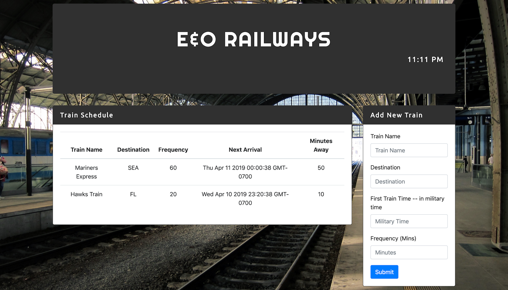

# TrainScheduler
Scheduling App for fictional Trains utilizing the JavaScript Library moment.js to calculate various moments in time. The purpose of this is to showcase the mathmatical power of JS.



## Installation

Best viewed in Chrome Browser.

OS X:

```sh
brew cask install google-chrome
```

Linux/Ubuntu 64-Bit:

```sh
sudo apt install chromium-browser
```

Windows:

https://www.google.com/chrome/

## Development setup

No installation needed as this runs in the Browser via the Giphy API.

## Meta

Distributed under the MIT License. See [LICENSE](LICENSE) for more information.

[https://github.com/jobu206/github-link](https://github.com/dbader/)


## Contributing

1. Fork it (<https://github.com/jobu206/TrainScheduler/fork>)
2. Create your feature branch (`git checkout -b feature/GIFtastic`)
3. Commit your changes (`git commit -am 'Add some yourMessageHere'`)
4. Push to the branch (`git push origin feature/GIFtastic`)
5. Create a new Pull Request